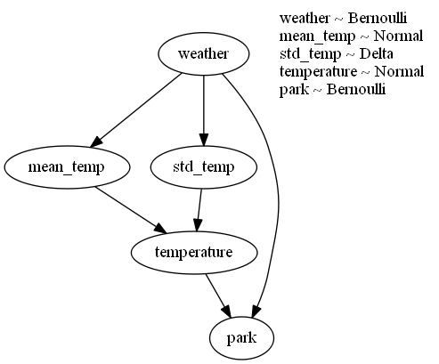

# Build a Probabilistic Graphical Model (PGM) using the [Pyro](https://pyro.ai) library
[Pyro](https://pyro.ai) is a universal probabilistic programming language (PPL) written in Python and supported by [PyTorch](https://pytorch.org) on the backend. It enables flexible and expressive deep probabilistic modeling, unifying the best of modern deep learning and Bayesian modeling. Pyro is designed to be scalable and performant, to be easy to use and extend, and to be applicable for large-scale PPL applications.

This example demonstrates how to build a simple PGM using Pyro.

This model is a simple PGM with three random variables: `weather`, `temperature`, and `park`. The `weather` variable is a Bernoulli distribution with a 70% chance of being sunny. The `temperature` variable is a normal distribution with a mean that depends on the `weather` variable. The `park` variable is a Bernoulli distribution that depends on both the `weather` and `temperature` variables. This is a pretty simple PGM example, but Pyro supports much more complex models and inference algorithms.

# Prerequisites
- [environment.yaml](environment.yaml) describes the conda environment used to run the code.

# Code
- [main.py](main.py) contains the code to build and plot the PGM using Pyro.

# PGM
The created PGM figure is shown below:

